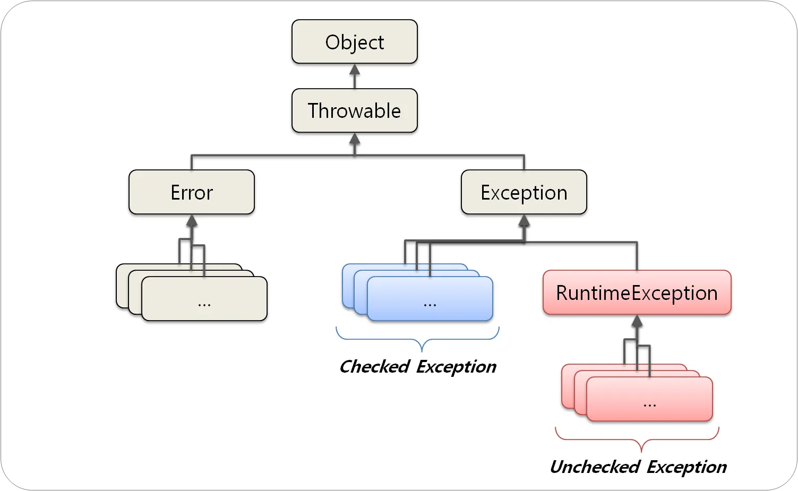
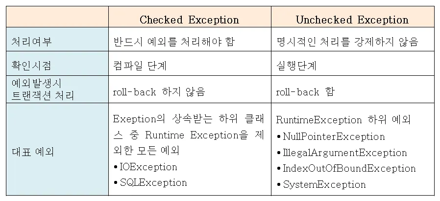

# java.md

### 목차

* [접근제한자](java.md#접근제한자)
* [Overloading/Overriding](java.md#overloadingoverriding)
* [Interface](java.md#interface)
* [체크 예외와 언체크 예외(Checked, Unchecked Exception)](java.md#체크-예외와-언체크-예외checked-unchecked-exception)
* [Wrapper Class](java.md#wrapper-class)
* [String class 의 문제점](java.md#string-class-의-문제점)
* [Set](java.md#set)
* [List](java.md#list)
* [Map](java.md#map)
* [Copy](java.md#copy)

### 접근제한자

* https://wikidocs.net/278


* **public 접근 제한자:** 단어 뜻 그대로 외부 클래스가 자유롭게 사용할 수 있도록 합니다.
* **protected 접근 제한자:** 같은 패키지 또는 자식 클래스에서 사용할 수 있도록 합니다.
* **private 접근 제한자:** 단어 뜻 그대로 개인적인 것이라 외부에서 사용될 수 없도록 합니다.
* **default 접근 제한:** 같은 패키지에 소속된 클래스에서만 사용할 수 있도록 합니다.

### Overloading/Overriding

#### 오버로딩(Overloading)

두 메서드가 같은 이름을 갖고 있으나 인자의 수나 자료형이 다른 경우를 말한다.

```jsx
public double computeArea(Circle c) { ... }
public double computeArea(Circle c1, Circle c2) { ... }
public double computeArea(Square c) { ... }
```

#### 오버라이딩이란

상위 클래스의 메서드와 이름과 용례(signature)가 같은 함수를 하위 클래스에 재정의하는 것을 말한다.

즉, 상속 관계에 있는 클래스 간에 같은 이름의 메서드를 정의하는 것을 말한다.

```jsx
public abstract class Shape {
  public void printMe() { System.out.println("Shape"); }
  public abstract double computeArea();
}
public class Circle extends Shape {
  private double rad = 5;
  @Override // 개발자의 실수를 방지하기 위해 @Override(annotation) 쓰는 것을 권장
  public void printMe() { System.out.println("Circle"); }
  public double computeArea() { return rad * rad * 3.15; }
}
public class Ambiguous extends Shape {
  private double area = 10;
  public double computeArea() { return area; }
}
```

### Interface

* 인터페이스에서 정의한 변수는 모두 상수
* 인터페이스의 메소드가 `default`키워드로 선언되면 인터페이스 내에서 구현될 수 있습니다.

```jsx
public interface Calculator {
    public int plus(int i, int j);
    public int multiple(int i, int j);
    default int exec(int i, int j){    // default로 선언하여 메소드를 구현할 수 있습니다.
        return i + j;
    }
}
```

### **체크 예외와 언체크 예외(Checked, Unchecked Exception)**

자바의 예외는 크게 3가지로 나눌 수 있습니다.

* `체크 예외(Checked Exception)`
* `언체크 예외(Unchecked Exception)`
* `에러(Error)`



#### 체크 예외(Checked Exception)

체크 예외는 `RuntimeException의 하위 클래스가 아니면서 Exception 클래스의 하위 클래스`들입니다. 체크 예외의 특징은 반드시 에러 처리를 해야하는 특징`(try/catch or throw)`을 가지고 있습니다.

* `존재하지 않는 파일의 이름을 입력(FileNotFoundException)`
* `실수로 클래스의 이름을 잘못 적음(ClassNotFoundException)`

체크 예외의 예시는 이러한 것들이 있습니다.

#### 언체크 예외(Unchecked Exception)

언체크 예외는 `RuntimeException`의 하위 클래스들을 의미합니다. 이것은 체크 예외와는 달리 에러 처리를 강제하지 않습니다.

말 그대로 `실행 중에(runtime)` 발생할 수 있는 예외를 의미합니다.

* `배열의 범위를 벗어난(ArrayIndexOutOfBoundsException)`
* `값이 null이 참조변수를 참조(NullPointerException)`
*



### Wrapper Class

```jsx
public class WrapperExam {
    public static void main(String[] args) {
        int i = 5; 
        Integer i2 = new Integer(5);
        Integer i3 = 5;                      //오토박싱
        int i4 = i2;                         //오토언박싱
        long i2_long = i2.longValue();
        long i4_long = i4.longValue();       // 오류 발생!
    }
}
```

`Integer`는 int의 `wrapper class`입니다. class이기 때문에 속성과 메소드를 가지는데요. 다음 코드를 실행해 보면 `Integer` 타입인 경우 필드와 method를 사용할 수 있지만, 기본형 타입인 int의 경우 필드와 method를 사용할 수 없는걸 확인할 수 있습니다.

이 때, `integer`타입과 `int`타입의 오토박싱, 오토언박싱의 경우에도 `Wrapper`클래스가 사용됩니다. i2는 `Integer`형이므로 longValue()메소드를 사용할 수 있으나 i4는 `int`형이므로 메소드를 사용하면 오류가 발생합니다.

### String class 의 문제점

```jsx
 // + 연산
String str3 = str1 + str2;     

 // 내부적으로 실행되는 코드
String str3 = new StringBuffer().append(str1).append(str2).toString();  
```

두 경우 결과는 같지만 `+`연산을 한 경우에는 반복문 안에서 내부적으로 `String` 객체를 만들냅니다. 매번 `new`를 사용해서 연산을 해야하기 때문에 속도가 그만큼 느려지는 것이지요.

문자열을 반복문 안에서 더하는 것은 성능상 문제가 생길 수 있으니 반드시 피해야 합니다.

### Set

```java
import java.util.*;

public class SetExam{
    public static void main(String[] args){
        Set<String> set = new HashSet<String>();
        set.add("a");
        set.add("a");
        set.add("b");
        
        System.out.println("set의 내용을 출력합니다.");
        for(String str : set){
            System.out.println(str);
        }
    }
}
```

`set`의 내용은 `for each`문 또는 `Iterator`를 활용해서 출력할 수 있습니다

`set`은 중복과 순서가 없는 자료구조입니다.

### List

`List`는 길이가 정해져 있지 않기 때문에 길이를 알 수 없는 배열을 더할때 유용하게 사용할 수 있습니다.

```java
List<String> list = new ArrayList<>();

list.add("kim");                 // list에 2개의 문자열을 저장합니다.
list.add("lee");

for(int i = 0; i < list.size(); i++){
    String str = list.get(i);    // list의 값을 받아올 때에는 list.get()을 사용합니다.
    System.out.println(str);
}
```

### Map

`Map`은 key와 value를 쌍으로 저장하는 자료구조

&#x20;`Map`에 값을 추가하기 위해서는 `put()`을 이용합니다.

```java
 Map<String, Integer> products = new HashMap<>();
 products.put("가위", 2500);
```

## Copy

shallow copy / deep copy

#### **얕은 복사(Shallow Copy) - call-by-reference**:


* '주소 값'을 복사
* 스택영역의 주소값을 복사

#### **깊은 복사(Deep Copy)**:


* '실제 값'을 새로운 메모리 공간에 복사하는 것을 의미
* 힙 영역

**Object.clone()**

```jsx
int[] arrData = {1,2,3};
int[] arrData2 = arrData.clone();
		
arrData2[0] = 10;
System.out.println(arrData[0]); -> 1
```

**Arrays.copyOf()**

```jsx
public class Array_Copy{
    public static void main(String[] args)  {
        int[] a = { 1, 2, 3, 4 };
        int[] b = Arrays.copyOf(a, a.length); // src arr, length
    }
}
```

**Arrays.copyOfRange()**

```jsx
public class Array_Copy{
    public static void main(String[] args)  {
        int[] a = { 1, 2, 3, 4 };
        int[] b = Arrays.copyOfRange(a, 1, 3); // src arr, src pos, length
    }
}
```

**System.arraycopy()**

```jsx
public class Array_Copy{
    public static void main(String[] args)  {
        int[] a = { 1, 2, 3, 4 };
        int[] b = new int[a.length];
        System.arraycopy(a, 0, b, 0, a.length); // src arr, src pos, dst arr, dst pos, length
    }
}
```
