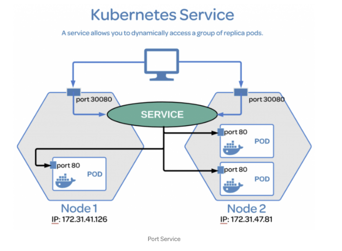

# service.md



* Service는 Pod 집합을 안정적으로 접근하기 위한 가상 IP(ClusterIP) 를 제공
* Pod의 IP는 변경될 수 있으므로 Service가 고정된 접근 지점 역할

```yaml
apiVersion: v1
kind: Service
metadata:
    name: my-service
spec:
    type: NodePort
    selector:
        app: web
ports:
    - port: 80
      targetPort: 8080
      nodePort: 30080
```

## Service Type


* ClusterIP: 내부에서만 접근 가능, 보안성, 설정 불필요
* NodePort: 간단한 외부 노출, 외부-내부 통신 연결, 포트범위 제한(3만번대일부), 포트 관리 부담
* LoadBalancer: K8s와 독립적 (외부 의존성), 편리함, 대규모 트래픽 처리
* ExternalName: 내부->외부 통신 용도

## Service Type ClusterIP

* ClusterIP는 쿠버네티스 클러스터 내부에서만 접근 가능한 서비스 타입입니다.
* 쿠버네티스 클러스터 내부에서만 접근 가능한 서비스 타입입니다.

[service](https://velog.io/@pinion7/Kubernetes-%EB%A6%AC%EC%86%8C%EC%8A%A4-Service%EC%97%90-%EB%8C%80%ED%95%B4-%EC%9D%B4%ED%95%B4%ED%95%98%EA%B3%A0-%EC%8B%A4%EC%8A%B5%ED%95%B4%EB%B3%B4%EA%B8%B0)
