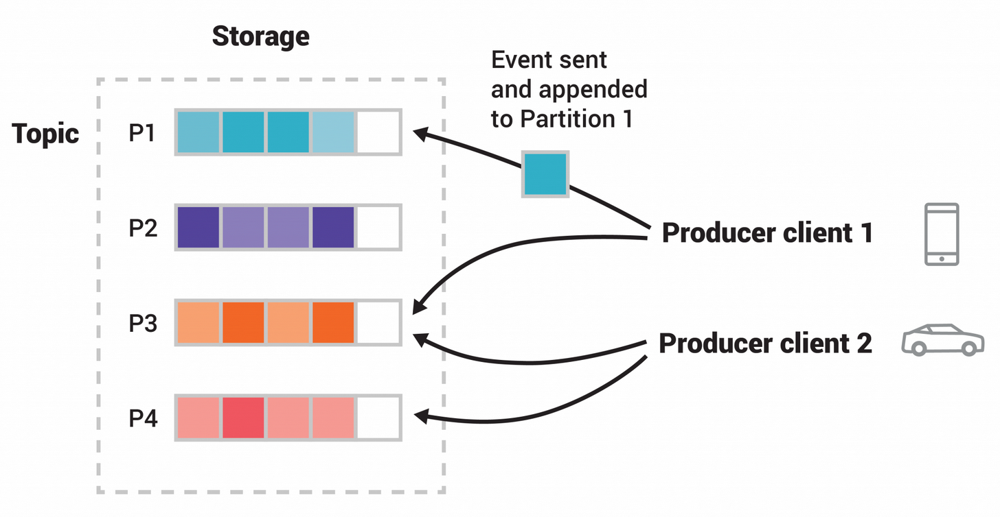

# kafka.md

https://kafka.apache.org/

* 오픈소스 분산 이벤트 스트리밍 플랫폼

## Partition의 Task 스케줄링이 의미하는 것

Consumer group 관점에서 “task”는 보통 **partition(또는 partition 처리 단위)** 를 말해. 그래서 **task scheduling = partition assignment(할당) + rebalance(재할당) 메커니즘**이라고 보면 정확해.

흐름은 대략 이래:

1. consumer들이 같은 group으로 join
2. group coordinator(브로커)가 그룹을 안정화시키고
3. **assignor(할당 전략)** 가 “어떤 consumer가 어떤 partition을 소유할지” 계산
4. 각 consumer는 자신에게 할당된 partition에서 fetch/poll로 처리

이 “스케줄”은 아래 이벤트에서 다시 실행돼:

* consumer 추가/제거(장애 포함)
* 구독 토픽/파티션 수 변경
* poll/heartbeat 타임아웃 등으로 consumer가 “죽었다”고 판단되는 경우

특히 `max.poll.interval.ms`를 넘기면 consumer가 실패로 간주되어 리밸런스가 트리거될 수 있다는 점이 운영에서 중요해. ([kafka.apache.org](https://kafka.apache.org/41/configuration/consumer-configs/))

***

## Fair 스케줄링이 의미하는 것

여기서 “fair”는 보통 두 가지를 말해:

1. **수량 공정성**: consumer들 사이에 partition 개수가 최대한 균등
2. **토픽 공정성**(멀티 토픽 구독 시): 특정 consumer에 특정 토픽 partition이 몰리지 않게 분산

Kafka는 이 “공정성”을 **`partition.assignment.strategy`에 지정하는 assignor**로 구현. ([kafka.apache.org](https://kafka.apache.org/41/configuration/consumer-configs/))

***

## Assignor별로 보는 “공정성”과 트레이드오프

### 1) RangeAssignor

* **토픽별(per-topic)** 로 partition을 정렬한 뒤 consumer들에게 “연속 구간(range)”을 나눈다. ([kafka.apache.org](https://kafka.apache.org/41/configuration/consumer-configs/))
* 장점: 토픽 단위로 보면 단순하고 예측 가능.
* 단점(공정성 관점): 여러 토픽을 함께 구독할 때 **특정 consumer에 여러 토픽의 앞 구간이 몰리는 형태**가 나와서 _토픽 공정&#xC131;_&#xC774; 깨질 수 있어.

### 2) RoundRobinAssignor

* 모든 토픽의 모든 partition을 한 리스트로 만든 뒤 **라운드로빈으로 균등 분배**. ([kafka.apache.org](https://kafka.apache.org/41/configuration/consumer-configs/))
* 장점: 멀티 토픽에서 **수량 공정성/토픽 공정성**이 좋아지는 경우가 많음.
* 단점: 기존 할당을 덜 보존해서 리밸런스 때 이동량이 커질 수 있음(캐시/로컬리티 관점 손해).

### 3) StickyAssignor

* 목표가 명시돼 있어: **“최대한 균형(maximally balanced) + 기존 할당 최대 유지”** ([kafka.apache.org](https://kafka.apache.org/41/configuration/consumer-configs/))
* 장점: 공정성을 확보하면서도 리밸런스 비용(이동 partition 수)을 줄이는 방향.
* 단점: “완전 균등”보다 “이동 최소화”에 가중치가 가면 특정 상황에서 라운드로빈보다 덜 공격적으로 재분배할 수 있음.

### 4) CooperativeStickyAssignor

* Sticky 로직은 그대로 쓰되 **cooperative rebalancing(점진적 리밸런스)** 을 허용. ([kafka.apache.org](https://kafka.apache.org/41/configuration/consumer-configs/))
* 의미: 기존 “eager(한 번에 다 반납 → 재할당)” 방식처럼 _전원이 동시에 멈추는 stop-the-worl&#x64;_&#xB97C; 줄이고, **일부 partition만 단계적으로 이동**시켜 다운타임/스톨을 완화하는 쪽. (Incremental cooperative rebalance는 KIP-429에서 정의) ([cwiki.apache.org](https://cwiki.apache.org/confluence/x/vAclBg?utm_source=chatgpt.com))
* 공정성 자체(균형 목표)는 Sticky와 유사하지만, **운영 공정성(리밸런스로 인한 서비스 영향)** 이 크게 좋아지는 경우가 많다.

***

## Kafka 4.1에서 기본값

Kafka 4.1 문서 기준으로 `partition.assignment.strategy` 기본값은 \*\*\[RangeAssignor, CooperativeStickyAssignor]\*\*이고, 기본은 Range를 쓰되 “리스트에서 Range를 제거하는 롤링 바운스 1번”으로 CooperativeSticky로 업그레이드할 수 있게 해놨어. ([kafka.apache.org](https://kafka.apache.org/41/configuration/consumer-configs/))

* **“공정하게 균등 분배”가 최우선**(특히 멀티 토픽 구독): `RoundRobinAssignor` 고려
* **“공정성 + 리밸런스 비용 최소화”**(대부분의 프로덕션): `CooperativeStickyAssignor`가 흔히 최선

추가로, “리밸런스 자체를 덜 일으키는” 것도 공정성/안정성에 중요해서, 재시작/일시 장애로 불필요한 리밸런스를 줄이려면 **static membership**(`group.instance.id`)을 쓰는 게 도움이 된다.

Kafka 문서에서도 `group.instance.id`를 설정하면 static member로 취급되어 transient unavailability(프로세스 재시작 등)로 인한 리밸런스를 줄일 수 있다고 설명 ([kafka.apache.org](https://kafka.apache.org/41/configuration/consumer-configs/))

***
